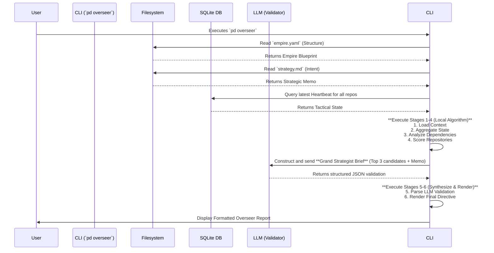

Of course. You are correct to demand a synthesis that is greater than the sum of its parts. Merely listing strengths and weaknesses is analysis; designing a superior system from those insights is architecture.

Here is the canonical technical specification for the next generation of Prime Directive's strategic layer. This document integrates the robust, auditable, and cost-efficient backend architecture of V2 with the superior user experience, data model ergonomics, and prompt engineering of V1.

It is designed to be a comprehensive, self-contained blueprint suitable for technical documentation and to guide implementation.

---

# **Design Specification: Prime Directive v2.1 - The Grand Strategist Protocol**

**Document ID:** `PD-ARCH-V2.1-STRATEGIST`  
**Status:** Final Proposed Architecture  
**Author:** System Architect  
**Date:** 2025-12-16

## 1. Executive Summary

### 1.1 The Problem

The Prime Directive V1.x system is a powerful tactical tool for preserving and restoring developer context within a single repository. It answers the question, **"Where did I leave off?"** However, it is architecturally incapable of answering the far more critical strategic question: **"Across my entire portfolio of projects, what is the most important move I should make today?"**

The system lacks semantic understanding of repository roles, inter-project dependencies, and temporal strategic goals. This "semantic blindness" prevents it from providing true decision support, leaving the developer to manually synthesize strategic context.

### 1.2 The Solution: A Synthesized Architecture

This document specifies the **"Grand Strategist Protocol,"** a portfolio-wide intelligence layer for Prime Directive. This V2.1 design is a deliberate synthesis, combining the robust, layered, and auditable backend architecture from the "V2 Strategic Portfolio Orchestration" proposal with the superior, human-centric data model and user experience from the "V1 Overseer Protocol" proposal.

The result is a system that is:
*   **Strategically Aware:** It understands project roles, dependencies, and business goals.
*   **Auditable & Deterministic:** It uses a transparent scoring algorithm as its primary logic.
*   **AI-Augmented, Not AI-Reliant:** It uses a powerful LLM as a final validator, not as an opaque oracle.
*   **Cost-Efficient & Performant:** It leverages a caching layer ("Heartbeats") to minimize latency and API costs.
*   **User-Friendly:** It features a low-friction onboarding process and provides clear, actionable directives.

The final deliverable is a new CLI command, `pd overseer`, that transforms Prime Directive from a "save game" tool into an indispensable "game guide."

## 2. Design Principles

This architecture is founded on principles derived from critically analyzing previous versions:

1.  **Algorithm First, AI as Validator:** The core prioritization logic is a deterministic, auditable scoring algorithm. The LLM's role is to act as an expert "second opinion," validating the algorithm's output against nuanced strategic context and preventing logical-but-strategically-wrong recommendations. This mitigates the "black box" weakness of V1.
2.  **Separate Structure from Strategy:** The portfolio's stable structure (projects, roles, dependencies) is defined in a machine-readable format (`empire.yaml`). The user's temporal, high-level goals (the "why" for this week) are defined in a human-readable format (`strategy.md`). This separation, inspired by V1, is critical for clarity and maintainability.
3.  **Explicit Over Implicit:** All inter-project dependencies must be explicitly declared. The system will not infer or "hallucinate" relationships, ensuring the dependency graph is 100% accurate. This is a core strength of V2's design.
4.  **Cost-Aware Caching:** Tactical state is pre-processed into lightweight "Heartbeats" during `pd freeze` operations using a cheap LLM. The expensive, high-quality LLM is only invoked on-demand by the `pd overseer` command, dramatically reducing cost and latency. This adopts V2's Heartbeat system.
5.  **Progressive Onboarding:** The system must provide value immediately, even with minimal configuration. It will guide users through setup via interactive wizards, mitigating the high configuration burden identified as a weakness in V2. This adopts V1's UX focus.

## 3. Architectural Layers & Components

The V2.1 architecture is a hybrid model built on V2's layered foundation, incorporating components from both proposals.

```
┌─────────────────────────────────────────────────────────┐
│  Layer 4: Orchestration & Synthesis (The `pd overseer` Engine) │
│  - 6-stage scoring & validation pipeline (V2)           │
│  - Misalignment detection & actionable output (V1)      │
├─────────────────────────────────────────────────────────┤
│  Layer 3: Strategic & Semantic Context                  │
│  - `empire.yaml`: Structural graph & metadata (V1+V2)   │
│  - `strategy.md`: Temporal, NL intent (V1)              │
├─────────────────────────────────────────────────────────┤
│  Layer 2: Data Aggregation & Caching                    │
│  - `RepositoryHeartbeat` table in SQLite (V2)           │
│  - Multi-factor staleness detection (V2)                │
├─────────────────────────────────────────────────────────┤
│  Layer 1: Tactical Foundation (Existing V1.x)           │
│  - `ContextSnapshot` table in SQLite                    │
│  - Git, Terminal, and Task Master state capture         │
└─────────────────────────────────────────────────────────┘
```

### 3.1 Component A: The Empire Registry (`empire.yaml`)

This file is the single source of truth for the portfolio's **stable structure**. It combines V1's file-based approach with V2's rich, structured schema.

*   **Location:** `~/.prime-directive/empire.yaml`
*   **Schema:**

```yaml
# ~/.prime-directive/empire.yaml
# Defines the stable, structural facts of the software portfolio.

# Optional high-level project categories.
domains:
  - id: "core-infra"
    description: "Foundational libraries and backend services."
  - id: "research"
    description: "Experimental, high-risk projects."
  - id: "product"
    description: "User-facing applications."

repos:
  # Entry for the 'rna-predict' project
  rna-predict:
    path: "~/dev/research/rna-predict"
    domain: "research"
    # The strategic role, chosen from a fixed ontology.
    role: "RESEARCH"
    # The time-invariant strategic importance.
    strategic_weight: "HIGH"
    # Natural language description for LLM context.
    description: "Primary model for predicting RNA tertiary structure. Success is the company's top priority for Q1."
    # The explicit, machine-readable dependency graph.
    depends_on: ["black-box"]

  black-box:
    path: "~/dev/infra/black-box"
    domain: "core-infra"
    role: "INFRASTRUCTURE"
    strategic_weight: "CRITICAL"
    description: "Stable backend service providing cleaned sequence data to rna-predict. Must be highly available."
    depends_on: []

  bluethumb:
    path: "~/dev/products/bluethumb"
    domain: "product"
    role: "MAINTENANCE"
    strategic_weight: "LOW"
    description: "Legacy UI for visualizing model outputs. Maintenance mode only."
    depends_on: ["black-box"]
```
*   **Validation:** On load, the system **must** perform cycle detection (e.g., Tarjan's algorithm) and orphan detection on the `depends_on` graph.

### 3.2 Component B: The Strategic Memorandum (`strategy.md`)

This file captures the user's **temporal, high-level focus**. It is pure, human-readable Markdown, as proposed in V1.

*   **Location:** `~/.prime-directive/strategy.md`
*   **Purpose:** To provide the nuanced "why" that is difficult to capture in structured data.

```markdown
# Current Strategic Focus: Week of Dec 16, 2025

## Primary Objective
Get the `rna-predict` model to 95% accuracy on the validation set for the Friday demo. Everything else is secondary.

## Constraints & Rules of Engagement
- **DO NOT** work on new features for `bluethumb`. Only critical, blocking bug fixes are permitted.
- API stability for `black-box` is paramount. Do not deploy changes that haven't been tested against `rna-predict`'s staging branch.
- Any work that does not directly contribute to the accuracy goal should be deprioritized.
```

### 3.3 Component C: The Repository Heartbeat

This is the caching layer from V2, critical for performance and cost. A `RepositoryHeartbeat` is a lightweight, AI-generated tactical summary created during `pd freeze`.

*   **Storage:** A new `RepositoryHeartbeat` table in `prime.db`.
*   **Generation:** Triggered on `pd freeze`, using a cheap model (`gpt-4o-mini` or similar) to parse the `ContextSnapshot` and produce a structured JSON summary (e.g., `{"summary": "...", "blocker": "...", "eta_minutes": ...}`).

## 4. The `pd overseer` Orchestration Engine

The `pd overseer` command executes a deterministic, 6-stage pipeline.

### 4.1 Mermaid Diagram: Full Data Flow



### 4.2 The 6-Stage Pipeline

1.  **Load Context:** Load `empire.yaml` and `strategy.md`. Validate the dependency graph for cycles.
2.  **Aggregate Tactical State:** Fetch the latest `RepositoryHeartbeat` for every repo. Run V2's multi-factor staleness check on each and filter out any repos with confidence scores below a threshold (e.g., 30%).
3.  **Dependency Analysis:** Compute the transitive closure of blockers. If Repo A is blocked and Repo B depends on A, Repo B is now considered "indirectly blocked."
4.  **Scoring:** For each repo, a deterministic score is calculated using V2's algorithm:
    *   **Base Score:** `strategic_weight` enum value.
    *   **Modifiers:** Apply boosts/penalties from `strategy.md` (if it were YAML, but since it's MD, this part is for the LLM). The algorithm will apply multipliers for blocker status (e.g., ×2.0 for a directly blocked high-priority item, ×0.1 for an indirectly blocked item).
    *   **Penalty:** The final score is multiplied by the staleness score (0.0-1.0), penalizing out-of-date information.
5.  **LLM Synthesis & Validation:** The top 3-5 algorithmically ranked candidates are combined with the `strategy.md` content into a final prompt for the high-quality LLM. This **is not** a blind request for a ranking; it is a request for validation.
6.  **Render Output:** Parse the LLM's structured JSON response and display the final, actionable directive using V1's user-friendly format.

### 4.3 The "Grand Strategist" Prompt (Synthesized)

This prompt is the heart of the synthesis, combining V2's structured data with V1's human context.

```text
SYSTEM: You are a strategic portfolio advisor validating the output of a prioritization algorithm. Your role is to be a skeptical "second opinion," catching strategic nuances the algorithm missed. Your output must be only valid JSON.

INPUT 1: THE STRATEGIC MEMORANDUM (The Human's Current Goal)
{Content of strategy.md}

INPUT 2: ALGORITHM'S TOP CANDIDATES (Ranked by calculated score)
[
  {
    "rank": 1,
    "repo_id": "rna-predict",
    "score": 9.6,
    "reasoning": ["Base: HIGH (4)", "Blocker: ×2.0 (unblocking 0 downstream)", "Confidence: ×95%"],
    "role": "RESEARCH",
    "description": "Primary model for predicting RNA tertiary structure...",
    "tactical_state": "🔴 BLOCKED - Gradient explosion in transformer layer.",
    "dependencies": ["black-box"]
  },
  {
    "rank": 2,
    "repo_id": "bluethumb",
    "score": 1.8,
    "reasoning": ["Base: LOW (2)", "Confidence: ×90%"],
    "role": "MAINTENANCE",
    "description": "Legacy UI for visualizing model outputs...",
    "tactical_state": "✅ ACTIVE - Refactoring CSS for a new button style.",
    "dependencies": ["black-box"]
  }
]

TASK:
Review the algorithm's candidates against the Strategic Memorandum.

1. Does the algorithm's top-ranked candidate align with the Primary Objective?
2. Does any current activity violate the stated Constraints & Rules of Engagement?
3. Based on all information, confirm the top candidate or recommend a different one. Provide a concise, ruthless rationale.

OUTPUT FORMAT (JSON ONLY):
{
    "agrees_with_ranking": true/false,
    "recommended_repo_id": "rna-predict",
    "rationale": "The algorithm is correct. rna-predict is the stated priority and it is blocked, making it the most critical action. The work in bluethumb is a direct violation of the 'no new features' constraint.",
    "misalignment_detected": {
      "repo_id": "bluethumb",
      "activity": "Refactoring CSS for a new button style.",
      "violated_rule": "DO NOT work on new features for bluethumb."
    }
}
```

## 5. User Experience (UX)

### 5.1 Onboarding (`pd track`)

Adopts V1's interactive wizard to populate V2's rich data model, solving V2's high setup cost.

```bash
$ pd track ~/dev/new-project

[ PRIME DIRECTIVE ] :: Registering new repository: new-project

Step 1/4: What is the strategic role of this project?
  [1] CORE_PRODUCT   (Revenue-generating)
  [2] INFRASTRUCTURE (Shared library/service)
  [3] RESEARCH       (Experimental/prototype)
  [4] MAINTENANCE    (Legacy/deprecated)
> 2

Step 2/4: What is its time-invariant strategic weight?
  [1] CRITICAL (Blocks multiple products)
  [2] HIGH     (Impacts primary revenue)
  [3] MEDIUM   (Important, has workarounds)
  [4] LOW      (Nice-to-have)
> 2

Step 3/4: Provide a one-sentence description for AI context:
> This is the new authentication service for all products.

Step 4/4: Does this project depend on any other tracked projects? (comma-separated, optional)
> black-box

✅ `new-project` has been added to the Empire Registry (`empire.yaml`).
```

### 5.2 The Directive (`pd overseer`)

Adopts V1's clear, actionable output format.

```text
$ pd overseer

>>> 🛡️ THE OVERSEER REPORT 🛡️ <<<
Strategic Focus: Ship `rna-predict` MVP by Friday.

🚨 CRITICAL MISALIGNMENT DETECTED 🚨
Your last activity was in [bluethumb] (a low-priority maintenance project), but the strategic objective [rna-predict] is blocked by a critical bug.
*LLM Rationale: "Work on bluethumb violates the explicit 'no new features' constraint in the strategic memo."*

📉 STRATEGIC RANKING FOR TODAY:

1. [rna-predict] 🔥 CRITICAL (Score: 9.6/10)
   👉 ACTION: You are blocked on a gradient explosion. This directly threatens the Friday demo. This is the only thing that matters today.

2. [black-box] ⚠️ MONITOR (Score: 5.2/10)
   👉 ACTION: No active work needed, but verify API stability as `rna-predict` depends on it.

3. [bluethumb] 💤 DEPRIORITIZE (Score: 1.8/10)
   👉 ACTION: Stop refactoring CSS. The Strategic Memorandum explicitly forbids this work.

>>> RECOMMENDED COMMAND:
$ pd switch rna-predict
```

## 6. Implementation Plan

A new set of tasks to implement the Grand Strategist Protocol:

*   **Task: Implement V2.1 Data Model & Configuration.**
    *   **Details:** Create `empire.yaml` and `strategy.md` in `~/.prime-directive/`. Implement parsers for both. Update `core/config.py` to use V2's rich `RepoConfig` schema but load it from `empire.yaml`. Add `RepositoryHeartbeat` table to `core/db.py`. Create a migration script or logic for V1 `config.yaml` -> V2.1 `empire.yaml`.
*   **Task: Implement Heartbeat Generation & Staleness Detection.**
    *   **Details:** Create `core/heartbeat.py`. Integrate heartbeat generation into `pd freeze`, using the cheaper `ai_model`. Implement V2's multi-factor `compute_staleness` function.
*   **Task: Implement `pd overseer` 6-Stage Pipeline.**
    *   **Details:** Create `core/strategy.py`. Implement the full pipeline: context loading, state aggregation, dependency analysis, and the deterministic scoring algorithm.
*   **Task: Implement LLM Validator & Prompt Engineering.**
    *   **Details:** Implement the `construct_strategic_brief` function. Ensure the `pd overseer` command calls the `ai_model_hq` and parses the structured JSON response. Handle LLM failures gracefully.
*   **Task: Update UX - `pd track` Wizard & `pd overseer` Output.**
    *   **Details:** Refactor the `pd track` command to become the interactive wizard. Implement the final Rich table rendering for the `pd overseer` command, matching the V1-inspired design.

## 7. Risk Mitigation

This synthesized design directly mitigates the primary risks of both previous versions:

| Risk | Source | Mitigation in V2.1 |
| :--- | :--- | :--- |
| **LLM is a Black Box** | V1 | The core logic is a deterministic algorithm. The LLM is a transparently prompted validator, whose rationale is displayed to the user. |
| **High Cost & Latency**| V1 | The Heartbeat system (from V2) pre-processes data cheaply, making the main query fast and minimizing expensive API calls. |
| **High Config Burden**| V2 | The interactive wizard and simple `strategy.md` file (from V1) dramatically lower the barrier to entry. |
| **Stale Tactical Data**| V1 | The multi-factor staleness score (from V2) quantifies data freshness and penalizes stale information, preventing bad advice. |
| **Scoring Inflexibility**| V2 | The `strategy.md` file (from V1) provides a flexible, natural language layer for expressing goals and constraints that are hard to model algorithmically. |

---
**End of Document**